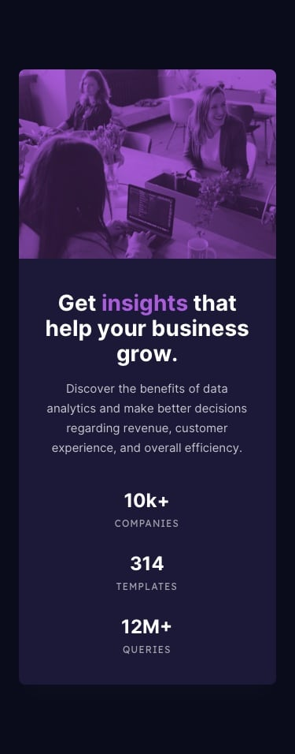

# 📊 Stats Preview Card Component

Projeto desenvolvido a partir de um desafio do Frontend Mentor com foco em **HTML5**, **CSS3**, **Flexbox**, **Responsividade** e organização de layouts modernos.

---

<div align="center">

# 🚀 Stats Preview Card Component

Um componente responsivo que apresenta estatísticas de negócios com um design moderno e elegante.


</div>

---

## 🔗 Links

### 🌐 Live Site

https://anaclarissi.github.io/stats-preview-card-component/

### 📂 Repositório

https://github.com/anaClarissi/stats-preview-card-component

### 🎯 Desafio Frontend Mentor

https://www.frontendmentor.io/challenges/stats-preview-card-component-8JqbgoU62

### 👩‍💻 Meu Perfil Frontend Mentor

https://www.frontendmentor.io/profile/anaClarissi

### 💻 Meu GitHub

https://github.com/anaClarissi

---

## 📸 Preview

### 💻 Desktop


### 📱 Mobile



---

## 🛠️ Tecnologias Utilizadas

* HTML5
* CSS3
* Flexbox
* Media Queries
* Google Fonts

  * Inter
  * Lexend Deca

---

## ✨ Funcionalidades

* Layout responsivo para desktop e mobile
* Overlay com destaque em tom roxo sobre a imagem
* Estatísticas organizadas de forma clara e intuitiva
* Tipografia moderna utilizando duas famílias de fontes
* Estrutura semântica e acessível

---

## 📂 Estrutura do Projeto

```bash
stats-preview-card-component/
│
├── index.html
│
├── assets/
│   ├── css/
│   │   └── style.css
│   │
│   └── images/
│
└── design/
```

---

## 🎯 Desafios Praticados

Durante a construção deste projeto foram trabalhados conceitos importantes como:

* Posicionamento com Flexbox
* Responsividade utilizando Media Queries
* Overlay sobre imagens utilizando posicionamento absoluto
* Organização visual de informações estatísticas
* Utilização de variáveis CSS
* Mobile First Adaptation

---

## 📚 Aprendizados

Este desafio ajudou a reforçar conhecimentos em:

* Estruturação de componentes reutilizáveis
* Criação de layouts adaptáveis
* Controle de proporções entre imagem e conteúdo
* Uso de tipografia para melhorar hierarquia visual
* Boas práticas de organização de CSS

---

## 🔮 Melhorias Futuras

* Implementar animações suaves na entrada do card
* Melhorar a acessibilidade com atributos ARIA
* Adicionar transições para os elementos estatísticos
* Refatorar utilizando metodologia BEM mais completa

---

## 👩‍💻 Autora

Desenvolvido por **Ana Clarissi**.

* GitHub: https://github.com/anaClarissi
* Frontend Mentor: https://www.frontendmentor.io/profile/anaClarissi
